

	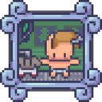

<h3 align="center">Character generator importer tool</h3>

  

   Speed up the process of creating animations from the character generator 2.0
	 
	·
	<a href="https://github.com/ninetailsrabbit/character-generator-importer-tool/issues/new?assignees=ninetailsrabbit&labels=%F0%9F%90%9B+bug&projects=&template=bug_report.md&title=">Report Bug</a>
	·
	<a href="https://github.com/ninetailsrabbit/character-generator-importer-tool/issues/new?assignees=ninetailsrabbit&labels=%E2%AD%90+feature&projects=&template=feature_request.md&title=">Request Features</a>
  

 
 

- [📦 Installation](#-installation)
- [Features](#features)
- [Getting started](#getting-started)
  - [Add the node to the scene](#add-the-node-to-the-scene)
  - [Choose the spritesheets to import](#choose-the-spritesheets-to-import)
  - [Select the parameters to import the spritesheets](#select-the-parameters-to-import-the-spritesheets)
  - [Select the adult animations you want to include](#select-the-adult-animations-you-want-to-include)
  - [Select the kid animations you want to include](#select-the-kid-animations-you-want-to-include)
  - [Click the "Generate Animations" button](#click-the-generate-animations-button)
- [How to import spritesheet parts](#how-to-import-spritesheet-parts)

# 📦 Installation

1. [Download Latest Release](https://github.com/ninetailsrabbit/character-generator-importer-tool/releases/latest)
2. Unpack the `addons/ninetailsrabbit.character-generator-importer-tool` folder into your `/addons` folder within the Godot project
3. Enable this addon within the Godot settings: `Project > Project Settings > Plugins`

To better understand what branch to choose from for which Godot version, please refer to this table:
|Godot Version|Character generator importer tool Branch|Character generator importer toolVersion|
|---|---|--|
||`main`|`1.x`|

# Features

- One tool node that only generates the animations and then can be deleted from the scene tree
- Create animated sprite and optionally the animation player for each spritesheet
- Generate all the animation frames from body parts to be able to customize the character inside Godot with resources
- Selectable Adult animations
- Selectable Kid animations
- Auto detect sprite size or set the values manually if you know the spritesheet size
- Support for importing individual spritesheets or all spritesheets contained within a folder

# Getting started

This is **an unofficial tool** that can be used as a plugin in Godot to speed up the process of creating animations for the character generator included in this asset https://limezu.itch.io/moderninteriors.

_There is no examples of spritesheet in the repository as it is a paid tool but the process is very simple I promise_

## Add the node to the scene

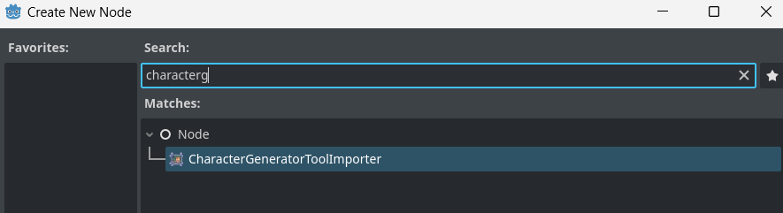

## Choose the spritesheets to import

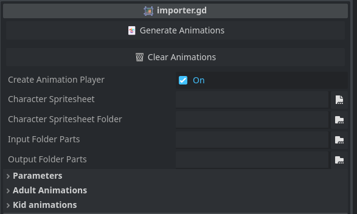

- `Generate animations`: Tool button to start the generation of `AnimatedSprite2D` from the spritesheets
- `Clear animations`: Clear the animations generated in the scene tree

---

- `Create animation player`: When active creates an `AnimationPlayer` node for each `AnimatedSprite2D`, needed if you want to use them later in an `AnimationTree`.
- `Character spritesheet`: Select an individual character spritesheet .png to import from your project
- `Character spritesheet folder`: Select a folder to import all the character spritesheets inside

---

- `Input folder parts`: The folder where all the individual spritesheet parts to import are, animation frames will be generated as resources.
- `Output folder parts`: The folder where to generate the output animation frames created from the spritesheets found at `input_folder_parts`

## Select the parameters to import the spritesheets

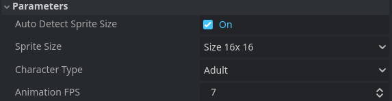

- `Auto detect sprite size`: The tool auto detect the sprite size and character type _(Adult, Kid)_ to create the frames correctly
- `Sprite Size` _(not used if auto is active)_ The character generator tool gives you an option to save the spritesheets into `16x16`, `32x32` or `48x48`. Set that value here if you already know the size beforehand
- `Character type` _(not used if auto is active)_ The type of spritesheet to import `Adult` or `Kid`
- `Animation FPS`: The animation fps value for the generated `AnimatedSprite2D`

---

## Select the adult animations you want to include

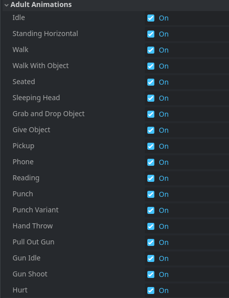

---

## Select the kid animations you want to include

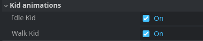

## Click the "Generate Animations" button

`Individual spritesheet`

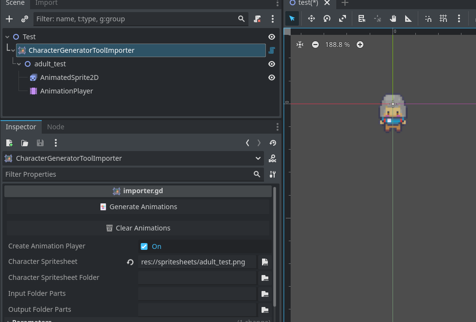

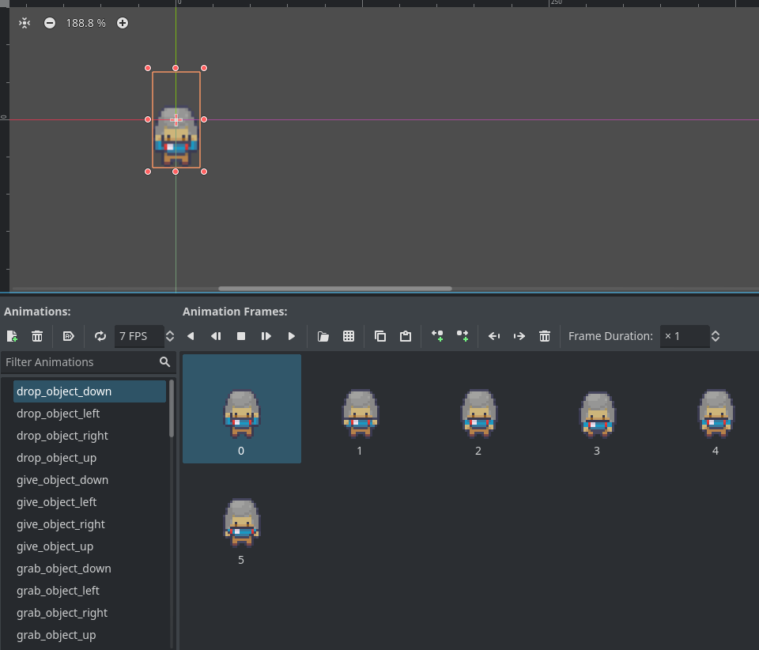

---

`Spritesheet folder`

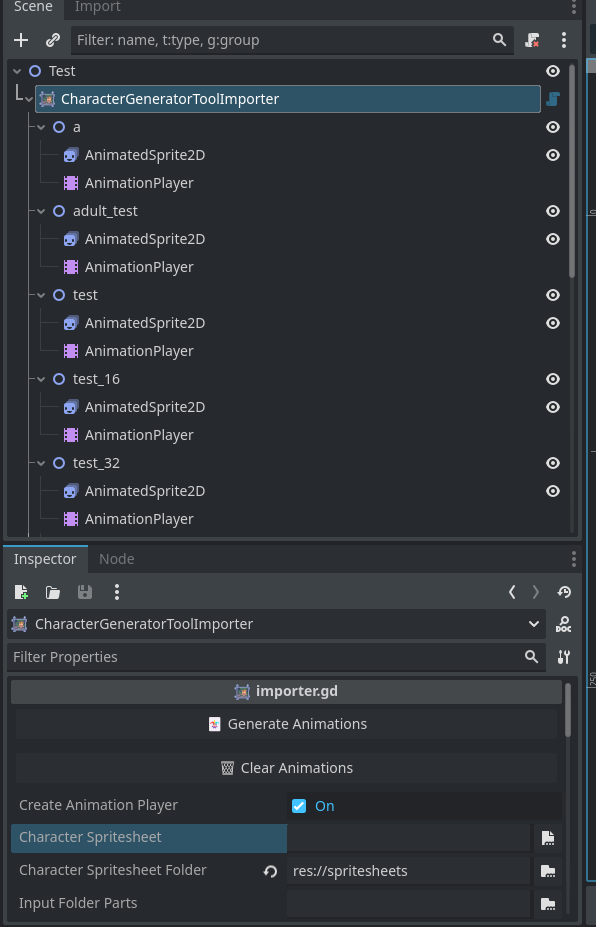

# How to import spritesheet parts

The character generator tool saves all the spritesheet as separated body parts on the path:

`C:\Program Files (x86)\Character Generator 2.0\Character Pieces`

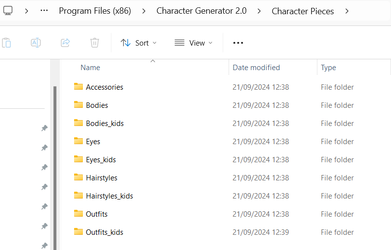

Set in the `CharacterGeneratorImporterTool` the property `input_folder_parts` with a folder that exists in your Godot project and then copy all the character pieces folders _(or only the parts you want)_ into it.

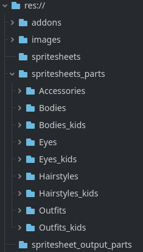

Set in the `CharacterGeneratorImporterTool` the property `output_folder_parts` with a folder that exists in your Godot project to generate the parts as animation frame resources

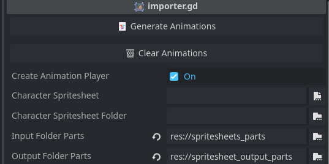

Click the `Generate Animations` button, this could take few seconds even using multiple threads so be patient if the editor freeze up for a moment.

⚠️ If you get an error when generate animations, you may have to restart the editor after importing all the parts ⚠️

---

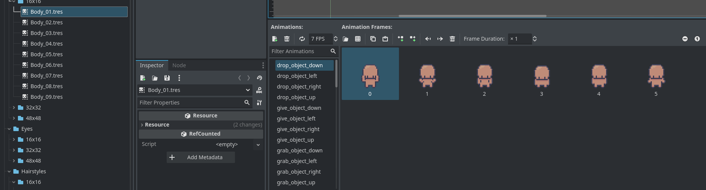
